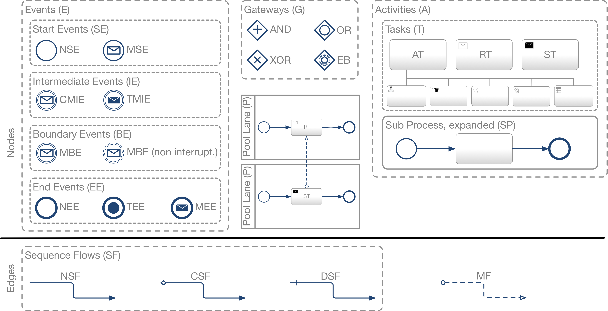
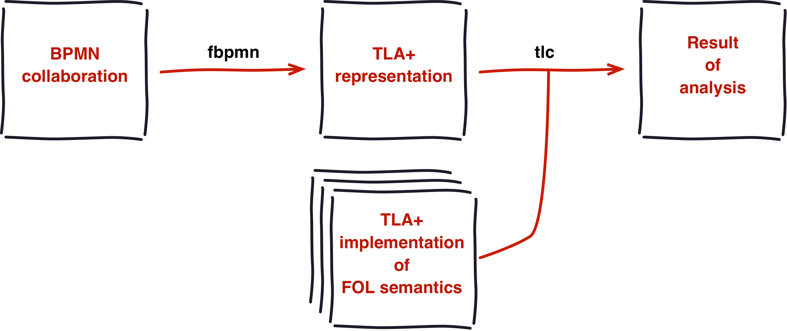

# fbpmn

[](https://travis-ci.org/pascalpoizat/fbpmn)
[](https://ci.appveyor.com/project/pascalpoizat/fbpmn)
[](LICENSE)
[](fbpmn.cabal)
<!--
<br/>
[](https://waffle.io/pascalpoizat/fbpmn)
-->
<!--
[](https://coveralls.io/github/pascalpoizat/fbpmn)
-->
<!--
<br/>
[](https://hackage.haskell.org/package/fbpmn)
[](http://stackage.org/lts/package/fbpmn)
[](http://stackage.org/nightly/package/fbpmn)
-->

formal tools for BPMN

## 1. Requisites

To verify your BPMN models, you will need:

- 1.1. The TLA+ tools, get `tla2tools.jar` [here](https://github.com/tlaplus/tlaplus/releases).

- 1.2. A Java SE Development Kit (JDK 8), get it [here](https://www.oracle.com/technetwork/java/javase/downloads/jdk8-downloads-2133151.html).

	There is an issue (wrt. `tla2tools.jar`) with version 11 so you will need to install version 8. 
	
If you build `fbpmn` from sources (required for **Windows**, optional for **Linux** and **OSX**), you will also need:

- 1.3. The `stack` build system for Haskell, see [here](https://docs.haskellstack.org/en/stable/README/).

	Under **Windows**, due to a bug, please use:
	
	```shell
	curl -sS -ostack.zip -L --insecure https://www.stackage.org/stack/windows-x86_64
	7z x stack.zip stack.exe
	```

## 2. Getting source files

Required for **all platforms** to get the TLA+ theories that are used in the verification process.

You can get the source files in either way:

- 2a. as an archive from [the fbpmn repository](https://github.com/pascalpoizat/fbpmn) by clicking the "Clone or download" button.

- 2b. by cloning the repository using the `git` command (see [here](https://git-scm.com/downloads) to get it).

	```shell
	git clone https://github.com/pascalpoizat/fbpmn
	```

## 3a. Getting a pre-built `fbpmn` binary

**Linux** and **OSX** binaries of stable versions of `fbpmn` are built using the continous integration server and are available [here](https://github.com/pascalpoizat/fbpmn/releases).

*We are working on having binaries automatically built for Windows.*

## 3b. Building `fbpmn` from source

Required for **Windows**.

```shell
cd fbpmn
stack clean
stack build
stack install
```

This will install the `fbpmn` command in some place that depends on your OS.
You can use `stack path --local-bin` to find out which directory it is.
Do not forget to put this directory in your command `PATH`.

## 3. BPMN models

`fbpmn` is able to deal with **collaborations** either in BPMN or in its own JSON format (see *6.*, below). Please note that you can also deal with a standalone **process model** (workflow) as soon as you put it in a standalone pool lane (we have some examples of this [here](models/bpmn-origin/src)).

### BPMN format

Please see [the BPMN 2.0 standard](https://www.omg.org/spec/BPMN/2.0/).

The subset of BPMN that we support is presented in Figure 1.


*Figure 1: supported subset of the BPMN notation.*

`fbpmn` has been tested with models made with the Camunda Modeler, which you can get [here](https://camunda.com/products/modeler/).

## 4. Verification using TLA+

### Principles

`fbpmn` supports the verification of:

- option to complete
- proper completion
- no dead activity
- safety
- soundness
- message-relaxed soundness

for six different communication semantics:

- unordered (bag of messages)
- fifo between each couple of processes (array of queues)
- fifo inbox (input queue at each process where messages are added)
- fifo outbox (output queue at each process where messages are fetched)
- global fifo (unique shared queue)
- RSC (realizable with synchronous communication)


*Figure 2: variations and properties (network unordered semantics).*

Verification is achieved in two steps (see Figure 3):

1. generate a TLA+ representation of the BPMN collaboration
2. use this representation and the TLA+ implementation of our FOL semantics for BPMN collaborations to perform verification (using the `tlc` model checker from the TLA+ tool box).


*Figure 3: `fbpmn` approach to the verification of BPMN collaborations.*

### Requirements

Verification requires that:

- `FBPMN_HOME` is set to the place where the `fbpmn` sources have been installed in step *2. Getting source files*.
- `TLA2TOOLS_HOME` is set to the place where `tla2tools.jar` is installed.
- `fbpmn` and `fbpmn-check` (see below) are found on the command `PATH`.

### Running the verification

**For Linux and OSX users**, we provide you with a script (in `$FBPMN_HOME/scripts/fbpmn-check`) that does the two steps described in Figure 3 for you and performs verification for each possible communication model.

```sh
fbpmn-check myModel.bpmn
```

**For Windows users**

*We are working on providing a script for Windows users too.*

Meanwhile, you will have to perform the tasks that are done in `fbpmn-check` by hand.

### Extending the verification

To add a **new communication model**:

1. define your new communication model semantics, say `MyNet`, in a `NetworkMyNet.tla` file in `$FBPMN_HOME/theories/tla/`
2. copy one of the files in `$FBPMN_HOME/theories/tla/Configs/` to a new file `NetworkNNMyNet.tla` in the same directory, with `NN` being a number different from the existing communication models there
3. in the contents of `NetworkNNMyNet.tla` change the line of the network implementation definition to refer to your new communication model as defined in step 1.

```tla
LOCAL NetworkImpl == INSTANCE NetworkMyNet
```

To add a **new property to verify**:

1. define your new property, say `MyProperty`,  at the end of the `PWSSemantics.tla` file in `$FBPMN_HOME/theories/tla`
2. create a new file `PropNNMyProperty.cfg` in `$FBPMN_HOME/theories/tla/Configs`, with `NN` being a number different from the existing properties there
3. in the contents of `PropNNMyProperty.cfg` refer to your property name as defined in step 1.

```tla
\* run with -deadlock
SPECIFICATION Spec
INVARIANT TypeInvariant

PROPERTY
  MyProperty
```

## 5. Help with `fbpmn`

To get help with `fbpmn`, run `fbpmn -h`.

```sh
❯ fbpmn -h
0.1.0

Usage: fbpmn COMMAND
  formal transformations for BPMN models

Available options:
  -h,--help                Show this help text

Available commands:
  version                  prints the version
  repl                     launches the REPL
  json2dot                 transforms a collaboration from JSON to DOT
  json2tla                 transforms a collaboration from JSON to TLA+
  bpmn2json                transforms a collaboration from BPMN to JSON
  bpmn2tla                 transforms a collaboration from BPMN to TLA+
```

But for the `version`and `repl` commands, you must provide two arguments: the source file and the target file for the transformation.

**No suffixes are to be given for source/target files when running `fbpmn`.**

`fbpmn` also has a REPL mode (run it using `fbpmn repl`) including the following commands:

```
quit (quit REPL)
help (list commands)
load (load current graph from JSON and verify file)
bpmn (load current graph from BPMN)
json (save current graph to JSON)
dot  (save current graph to DOT)
tla  (save current graph to TLA+)
```

**Suffixes are to be given when using the REPL.**

## 6. JSON format

The JSON format for a model can be generated from the BPMN format of it, using `fbpmn bpmn2json`.
In general, there should therefore be no need to write out models in the JSON format manually.

Examples of models are given [here](models/bpmn-origin/json_from_bpmn) for files generated from BPMN, and [here](models/json-origin) for files created manually.

To help in writing the JSON format, `fbpmn` has a very basic output to the format of the `dot` command ([graphviz format](https://graphviz.org)).
To transform a JSON file into DOT, run:

```shell
fbpmn json2dot sourcefile targetfile
```

where neither `sourcefile` nor `targetfile` have a suffix (the correct ones will be added by `fbpmn`).
Then provided you have `dot` installed, you can generate a picture for your collaboration, using:

```shell
dot -Tpng sourcefile.dot -o targetfile.png
```

