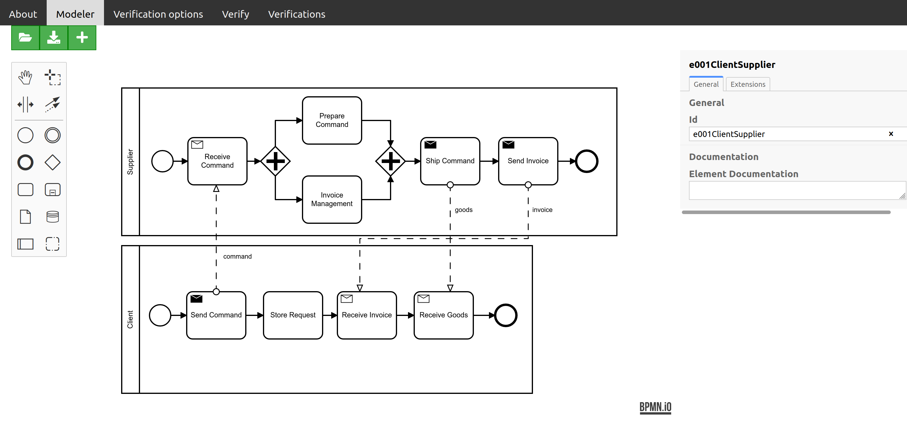
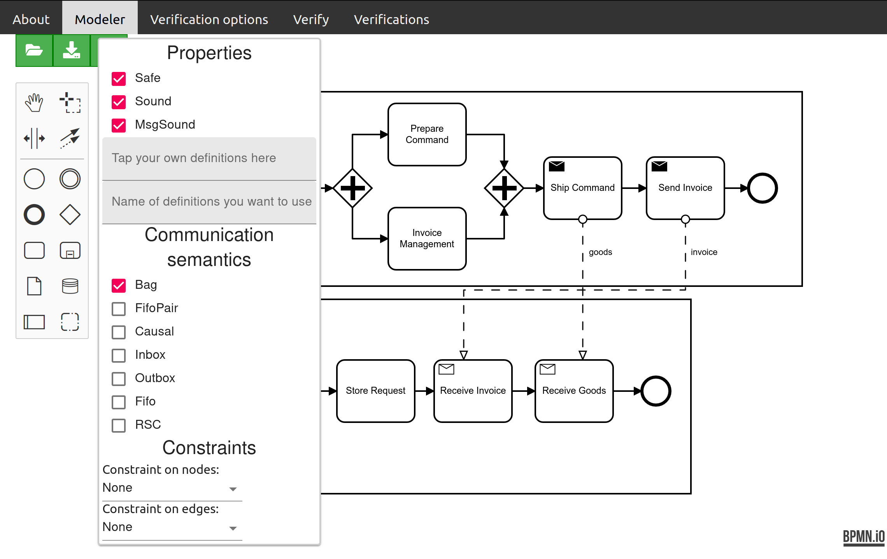
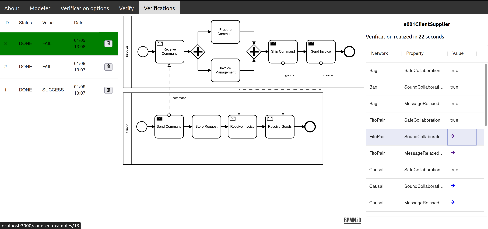
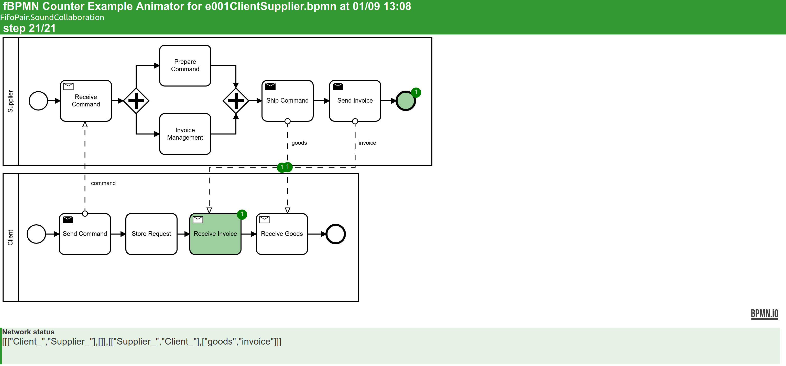

# fBPMN Web-application

## Installing and running

You can launch the entire web-application, with two ways:
### 1. With docker-compose (recommended):
- 1.1. Make sure you have the command `docker-compose` and Docker is up and running.
- 1.2. From this directory, launch the command `docker-compose build`
- 1.3. After that you can launch `docker-compose up`. You can access to the web-app frontend in [http://localhost:3000](http://localhost:3000) and its API in [http://localhost:5000/api/doc](http://localhost:5000/api/doc)

### 2. With yarn (not recommended, requires installation of several javascript / python tools and libraries):
Go in the frontend directory for more informations

## Usage

The web application is divided into two parts: frontend and backend. You can find more information about the backend in the pdf document in the doc directory.
The frontend is made **with React, a JavaScript library.**
   
- The nav-bar allows you to perform some actions through the application.
In the modeler part you can open, save, create, modify a BPMN model. On the right there is a property panel where you can enter metadata of the model such as its name or documentation. 

**Before clicking on Verify, make sure you enter the options you want for verification in the verification Options menu.**

---
   
- The first two groups of checkboxes are the properties and semantics that we have made available to you. By hovering your mouse over their names you will get a definition of the object.
You can also define your own definitions in TLA in the first textfield, they will be taken into account only when you write its name in the second textfield. At the bottom you can also set the constraints of the verification.

**Once the verification is launched, go to the verification section.**

---
   

- The left part lists all the verifications you have made and indicates some information. You can also delete them by clicking on the trash icone
The middle part is an image of the model on which the verification was based.
The right part details the results of the verification by communication and property - you can sort this list by clicking on the column name. 

**In each line is indicated a value, indicating if the property has been verified, true if it is the case, otherwise a link to the associated counter-example.** 

---
   

Here you can play with the counter example using &leftarrow;/&rightarrow;/`Shift`&leftarrow;/`Shift`&rightarrow; on your keyboard.
